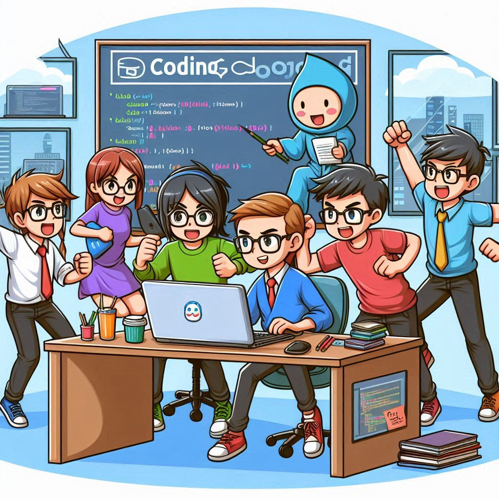
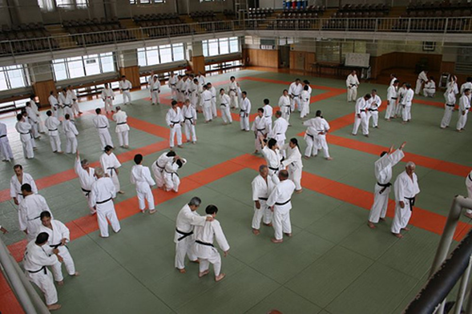
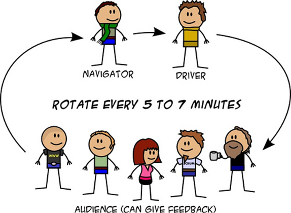
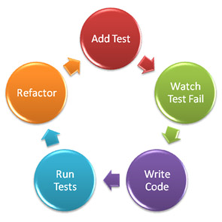
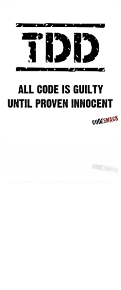

# Coding Dojo Sessions

## What ?

- The word dojo, meaning “the place of the way,” comes from Japanese martial arts. It is an honored place where students and masters come together for deliberate practice to develop their skills

- Coding Dojo is a session for EVERYONE who want learn about software development.

### References

- [Challenge list](./challenges/readme.md)
- [Templates list](./src/readme.md)

### Characteristics

- Everyone present is invited to help
- Non-competitive, collaborative, fun environment
- All skill levels are welcome
- Safe to try new ideas

## Why ?

- Continuous Learning
- Improve social skills as communication, leadership and self-organization

## How ?

- Session:
  - Target: solve a code challenge (or at least try) using [TDD](#tdd).
  - Time-Boxed:
    - 90 mins - 120 mins max
    - you can repeat it but ALWAYS start from the beginning
  - Coding pair (driver and navigator).
- Shift:
  - Each pair has a small (5 to 10 minutes) timebox to advance
  - At the end of the timebox, the driver goes back to the audience, the navigator becomes driver and one of the audience step up to be navigator
- Quick Retro:
  - continue / start / stop doing

### Roles

During each turn, we have:

#### Driver

- your are responsible for coding ... the keyboard is only yours 😁
- speak loud and explain your decisions and code implementation

#### Navigator

- your are responsible for map and directions ... but please, do not touch the  keyboard 😁
- help driver with technologies (language, patterns and etc)
- bring new ideas

#### Audience

- Test running successful (green)
  - ask, suggest ideas and share feedbacks
- Test failing (red)
  - keep in silence and let drive and navigator work and fix the issues

## TDD

- TDD (Test Driven Development) is a development technique where you first write the test (specification) before actually coding.
- Create test using Triple A pattern ( arrange, act, assert)

- Encourage code simplicity
- Increase code confidence and refactoring eligibility

